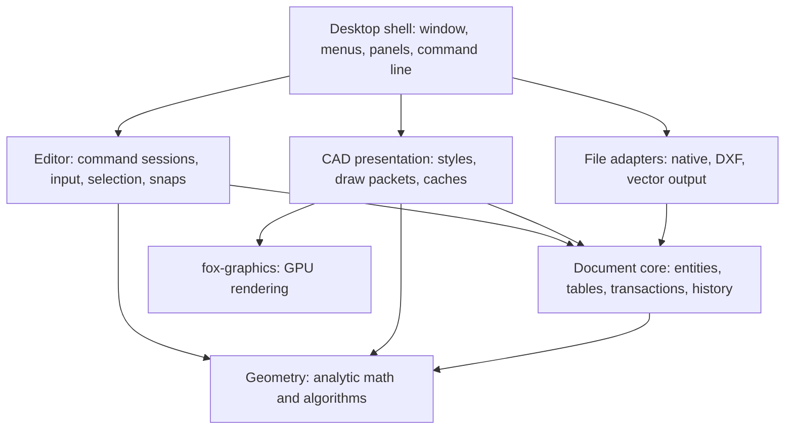

# FoxCAD architecture and implementation plan

Status: approved direction with egui selected. Phase 0 integration spike implemented; see [Phase 0 decisions and validation](phase-0.md) for verified behavior and outstanding platform checks. Later phases remain planned.

## 1. Direction

Build a native, cross-platform, command-driven 2D drafting application in Rust. Keep the editable drawing as a CPU-side analytic document, run editing through an explicit command engine, and use fox-graphics to render a derived view of the document.

The defining experience is precise drafting: commands, numeric entry, predictable selection, object snaps, layers, annotation, and reliable undo. Rendering speed supports that experience; it does not define the document representation.

Initial assumptions:

- macOS is the primary development and usability target; Windows and Linux remain supported architectural targets from the beginning.
- “Native” means an installed desktop executable without a browser or webview. Platform integration is desirable; native widgets are not required.
- AutoCAD-like means familiar command workflows and coordinate conventions. Exact command parity, AutoLISP compatibility, and lossless DWG compatibility are separate future decisions.
- Model space is a Cartesian 2D plane. No 3D solids, constraint solver, feature tree, or parametric regeneration system.
- Start with one visible drawing viewport, while keeping document sessions and view state separate so tabs and layouts can follow.
- Files remain local; collaboration and cloud services are out of scope.

Recommended foundation: a small Cargo workspace for FoxCAD, with fox-graphics developed alongside the application as its graphics library. Any necessary fox-graphics API, dependency, lifecycle or rendering changes are in scope; compatibility with fig is explicitly not required. Use modules inside a few crates rather than a crate for every subsystem.

## 2. What exists today

The foxcad directory was empty at the initial architecture inspection. The following table records that original baseline; Phase 0 has since replaced the fox-graphics prototype API. It is historical context, not the current implementation inventory.

| Existing area | Observation | Architectural consequence |
| --- | --- | --- |
| fox-graphics/src/lib.rs | Owns window creation, GPU initialization, surface configuration, and the event loop | Separate reusable renderer services from application lifecycle |
| fox-graphics/src/app.rs | Application trait and builder combine state, pipelines, a 3D camera, and text resources | Replace or remove the harness as needed; design lifecycle ownership for FoxCAD |
| fox-graphics/src/data.rs | Vertex positions are f32 triples | Appropriate for GPU buffers, not the authoritative CAD model |
| fox-graphics/src/camera/ | Perspective/3D camera and controller scaffolding | Build a dedicated orthographic 2D viewport; retain 3D code only if useful to the new design |
| fox-graphics/src/text.rs | Fixed atlas loading and GPU binding prototype | Reuse the experiment as reference; establish a font/layout boundary before expanding it |
| fig/src/main.rs | G-code becomes a vertex buffer; rendering is selected by pipeline name; text rendering portions are commented out | Useful integration sample, not an editable document architecture |
| fig/src/text.rs | Hand-mapped atlas characters and byte-based string lengths | Replace this assumption for Unicode shaping and text editing |
| Cargo manifests | wgpu 0.16.1, winit 0.28.6, mixed cgmath/glam; fig uses sibling path dependencies | Select a compatible dependency set in an early spike; migrate deliberately |

Two existing event-loop policies must change for CAD: unhandled Escape currently exits the application, and redraw is requested continuously. Escape should cancel drafting interactions; an idle drawing should usually stop redrawing.

## 3. Logical architecture



Arrows mean dependency/use, not ownership. The desktop application is the composition root: it creates services and connects outputs to inputs.

The most important dependency rule is that geometry, document, and editor code do not depend on wgpu, winit, or a GUI toolkit. File adapters never need a GPU to load or save a drawing. fox-graphics never knows what a CAD layer, selection set, command, or dimension means.

### State ownership

| Owner | Authoritative state | Lifetime |
| --- | --- | --- |
| Application | Open sessions, preferences, recent files, job scheduler | Application |
| Document session | Document, undo history, save checkpoint, file identity | Open document |
| Document | Entities, layers, styles, block definitions, units, drawing settings | Persisted |
| Editor session | Active command, selection, input defaults, snap modes | Editing session |
| Viewport | Center, scale, rotation, viewport rectangle, pointer mapping | View |
| Presentation | Bounds/index caches, display packets, tessellation cache | Rebuildable |
| GPU renderer | Buffers, atlases, pipelines, device resources | Device |

Spatial query indexes are owned by an editor/query service, not solely by the renderer. Headless selection and snapping must work independently of rendering. Render caches and query caches may share bounds computation, but are separately invalidated.

Do not serialize hover, selection highlights, GPU buffers, command previews, or active pointer gestures as drawing content. Workspace preferences and view restoration may be saved separately.

## 4. Geometry kernel

Use f64 for persisted coordinates, transformations, intersections, distances, and camera calculations. Define semantic point/vector/angle/bounds/transform types around a consistent math backend; avoid exposing unrelated math-library types throughout the public API.

Initial analytic primitives:

- Point, line segment, infinite construction line/ray.
- Circle and circular arc with explicit sweep convention.
- Polyline containing straight and circular-arc segments; explicit closed/open flag.
- Axis-aligned bounds and 2D affine transformations.
- Later: ellipse/elliptical arc and spline curves.

Keep circles and arcs analytic. Render tessellation is disposable and must never become the input to exact snapping, trimming, measurement, or file saving.

Core algorithms include bounds, closest point, parameter evaluation, intersections, splitting, transforms, distance, length, and enclosed area where defined. Return explicit classifications for tangency, overlapping curves, coincident geometry, and degenerate inputs rather than guessing a single intersection point.

### Numerical policy

Separate three tolerances:

1. Numerical tolerance for computations, scaled to local geometry and operation.
2. User-visible modeling/join tolerance in drawing units.
3. Interaction tolerance measured in logical screen pixels, converted through the viewport.

Do not adopt one global epsilon for all three. Test very small geometry, large world coordinates, near-parallel lines, nearly tangent curves, and zero-length inputs. Use robust orientation/intersection predicates where ordinary floating-point comparisons prove insufficient. Reject non-finite values at model boundaries.

Drawing units are document metadata. Changing display formatting does not scale geometry. An explicit unit-conversion operation scales geometry and relevant dimensional properties in one transaction. Angles use one internal convention, with user-facing degrees and formatting handled at the input/output boundary.

Nonuniform scale changes circles into ellipses. Until ellipse entities exist, commands must reject such transforms for affected geometry with an explanation. Mirroring must update arc orientation correctly.

This is a focused drafting kernel, not a general solid-modeling or topological B-rep kernel. Offset, fillet, hatch, and spline algorithms are substantial projects and receive their own milestones.

## 5. Document model

Use an explicit entity enum with shared metadata and typed payloads. This keeps serialization, exhaustive matching, validation, and migration straightforward. Avoid a general ECS or dynamic plugin entity ABI initially.

### Entity metadata

Each entity has a stable, opaque EntityId, owner space/block, layer reference, property overrides, and deterministic draw order. Entity storage order and GPU offsets are implementation details.

Use persistent document-local identifiers and a separate internal storage lookup. Never reuse a deleted persistent ID within a document; undo restores the original ID. Import and clipboard paste allocate fresh IDs and remap references. A subentity reference identifies an entity plus a local segment/vertex/feature and carries enough validity information to detect stale references after topology edits.

### Entity payloads and tables

| Area | Initial representation |
| --- | --- |
| Geometry | Line, circle, arc, polyline; point as needed |
| Text | Unicode content, insertion point, text style, height, rotation, alignment |
| Layers | Stable ID, name, visibility, lock state, color, linetype, lineweight |
| Styles | Text style, linetype definitions; dimension styles when dimensions arrive |
| Blocks | Reusable definition with owned entities; instance with transform and attributes later |
| Drawing settings | Units, numeric formatting, defaults and drafting-related document settings |
| Spaces | Model-space ownership initially; paper spaces and layouts added later |

Represent ByLayer, ByBlock, and explicit overrides as distinct property values. Resolve the effective appearance in presentation/query services. Hidden geometry is excluded from ordinary interaction. Locked geometry can be inspected and used as a snap reference, but edit operations reject it; frozen-layer behavior can be added with layout support.

For blocks, prohibit recursive definition cycles. Query results must retain the instance path and transform so snapping can report world-space features without destroying block identity. Defer nested editing until basic insert/explode behavior is solid.

### Annotation without constraints

Dimensions are annotation entities with measured geometry, style, text placement, and optional references. They never drive the geometry. First deliver non-associative dimensions with explicit definition points. Later, optional one-way associations can update measurements after edits; dangling references must be visible, not silently rebound.

Likewise, associative hatches are optional dependency updates, not a constraint system. Initially hatches may own explicit boundary geometry. These choices keep the first release simpler without preventing useful drafting associations later.

## 6. Commands and interaction

There are three distinct concepts:

- **Command definition:** discoverable name, aliases, description, input contract, availability and behavior category.
- **Command session:** the active state machine collecting points, selections, numbers and options, and producing previews.
- **Document transaction:** validated changes committed to the model and recorded for undo.

A command is not itself an undo record. PAN and ZOOM change view state; SAVE performs a file operation; LINE changes the document. The command registry covers all of them without forcing them into document history.

### Common invocation path

Typed names, autocomplete, menus, toolbar buttons, shortcuts, property panels, and future scripts dispatch a CommandId plus typed arguments. GUI actions must not manufacture command-line text and feed it back through a parser. They share the same semantic handlers and validation. They also publish the same session presentation to the command-line toolbar: command name, current prompt, input fields, accepted values, available keywords, validation messages and completion status. Clicking LINE must show exactly the same drafting prompts as invoking LINE through typed autocomplete. Fully supplied GUI actions still report their invocation and outcome; they do not artificially pause at already satisfied prompts. Invocation origin may be recorded for diagnostics, but does not select a different command UI.

Every user operation has a command/action identity. Pointer movement and individual keystrokes are input events inside that operation, not thousands of separate history entries. Selection gestures are an implicit SELECT interaction; mouse-wheel zoom is a ZOOM invocation with gesture updates.

A registry entry provides canonical name, aliases such as L for LINE, category, help text, repeatability, argument metadata, and valid invocation contexts. Contextual completion suggests command names when idle and keywords/values required by the active prompt while drafting. Stable command IDs remain separate from localized labels and configurable aliases.

### Extensible command contract

Command extensibility is a foundation requirement. Define a small `foxcad-command-api` crate containing toolkit-independent command descriptors, session interfaces, prompt/input schemas, semantic events, presentation DTOs and host-service contracts. Built-in commands register through this same public interface. Adding a command must not require editing a central command enum, dispatcher match, or GUI-specific prompt implementation.

The contract has five parts:

1. **Registration:** a provider registers namespaced IDs (for example `foxcad.line`), names, aliases, help, availability and session factories. The registry rejects duplicate IDs and resolves alias collisions explicitly through user configuration; plugins cannot silently replace built-ins.
2. **Session lifecycle:** a factory creates private per-invocation state. A session exposes its current prompt schema and handles semantic events to continue, finish or cancel. It declares its incremental/atomic commit behavior and repeat behavior.
3. **Host access:** commands obtain scoped read/query services for entities, geometry, selection and drafting context. They request validated transactions, view changes or application services through explicit host operations. No direct document mutation, renderer ownership, or GUI widget access is required.
4. **Presentation:** commands return structured prompt state, errors, options and transient geometry. The host draws fields, command history and overlays identically for built-in and external providers. Preview primitives remain toolkit/GPU independent.
5. **Lifetime and failure:** sessions are owned by the editor; cancellation disposes previews and outstanding requests. Async results carry session identity and document revision. Errors leave committed transactions valid and discard uncommitted work. Providers cannot unload while their sessions are active.

Initially, providers are statically linked Rust modules/crates implementing these interfaces. Include an independently compiled example provider in the acceptance tests to prove that extension works without changing the host. Runtime discovery/loading, distribution, hot reload and scripting remain deferred.

The Rust interface is a source-level contract, not a promise of a stable dynamic-library ABI. A future loader must adapt a versioned boundary (such as a C ABI, a sandboxed runtime, or a process protocol) to the same host/session semantics; do not pass Rust trait objects across independently compiled binary boundaries. Keep DTOs and service handles explicit so that adapter does not require redesigning commands. Version the API and negotiate supported capabilities when external loading is introduced. A statically linked provider is trusted code, not sandboxed by the interface.

Initial extensions compose existing entities and operations. Plugin-defined persistent entity types would require additional geometry, serialization, migration and rendering contracts and are a separate feature. Undo stores host-owned changes, so it remains functional without calling plugin code again.

### Input vocabulary

Normalize platform events into semantic editor input: field edits, field navigation, submitted input groups, submitted text, accepted point, selection result, distance, angle, keyword, accept/default, cancel, and pointer updates. The common input controller handles field editing; command sessions receive validated typed values and explicit lifecycle events.

Support absolute `10,20`, relative `@10,20`, and relative polar `@25<30` entry. Explicit coordinates bypass snaps; a bare distance may use the current direction when the command allows it. Prompts explain the active convention. Parse numeric values with documented decimal/unit rules; do not let locale-specific commas ambiguously mean both decimals and coordinate separators.

Typed input and mouse-picked points resolve to the same geometric value before command execution. Retain provenance for feedback and future associations. IME composition is handled by the text widget and does not invoke commands until committed.

### Structured inputs and Tab navigation

Each command state declares an ordered input group with stable field IDs, labels, value types, required/default status, units, validation and supported representations. For a Cartesian point the group contains X and Y; a polar representation contains distance and angle. Tab and Shift+Tab move forward/backward through the current group's editable fields without advancing the command state or committing geometry.

The command toolbar renders these fields inline with the prompt. A point can be supplied either as compact coordinate text (`10,10`) or through fields (`10`, Tab, `10`, Enter). Both resolve to the same Point2 value. Compact syntax is parsed only where the schema allows it; free-form text fields retain normal text-editing behavior.

For LINE's first-point state:

| User input | Input group | Command effect |
| --- | --- | --- |
| Invoke LINE from any source | X focused; Y empty | Show “Specify first point” |
| Type `10` | Draft X = 10 | Remain in first-point state |
| Tab | Preserve X; focus Y | No point accepted |
| Type `10` | Draft Y = 10 | Preview may reflect the complete draft point |
| Enter | Validate and submit (10, 10) | Set anchor; show next-point group |

The next-point group starts with fresh drafts, preserving only declared command defaults and coordinate mode. Enter submits the entire group from any field when all required values are valid. Missing or invalid values keep the group open and focus the first error. Enter with a completely empty group invokes the state's declared default, such as finishing LINE after its first point; partially entered coordinates never accidentally finish a command. Tab on the final field wraps within the active group; provide an explicit way to move focus out of the toolbar for accessibility.

At command-name entry, Tab accepts/cycles command completion. During a multi-field prompt, Tab always navigates fields; use arrow keys and an explicit completion selection for keyword suggestions. The host owns these bindings consistently for every provider.

Draft fields are shared input state, not independently duplicated between the toolbar and any cursor-adjacent input. Pointer hover may update a candidate preview but never overwrite typed fields. With no edited fields, a click accepts the snapped candidate point. With partial typed input, require completing/submitting or explicitly clearing the group before a canvas click accepts a different point; avoid silently discarding numeric intent. Suspend and restore draft/focus state during transparent pan/zoom. Escape clears an edited draft first, then a subsequent Escape follows the command's cancellation policy; this behavior and any command-specific exception must be shown consistently.

A bare distance is accepted only in an explicitly indicated distance/direction input representation. In the Cartesian X/Y group, `10` is an X draft, not an implicit distance. This prevents ambiguity between numeric shortcuts and field navigation.

### Example: LINE

| State | Accepted input | Output |
| --- | --- | --- |
| Await first point | Mouse point or coordinate | Set anchor; prompt for next point |
| Await next point | Pointer motion | Rubber-band preview and dynamic measurement |
| Await next point | Accepted point | Commit one line segment; advance anchor |
| Await next point | Undo keyword | Remove the latest segment in the active command group |
| Await next point | Close keyword when valid | Add closing segment and finish |
| Await next point | Enter with empty group, or Escape with no edited draft | Finish; retain accepted segments; discard preview |
| Await first point | Escape with no edited draft | Cancel without document changes |

Accepted segments are visible committed edits grouped into one global undo item when LINE ends. This is a deliberate incremental-command policy. By contrast, MOVE previews a transform and commits only after the destination is accepted; Escape leaves the document unchanged. Each command definition declares its commit/cancel policy.

Command-local Undo removes a step of the current interaction. Global UNDO operates on finalized transaction groups. Do not ambiguously apply both.

### Selection and drafting aids

Support preselection and command-requested selection through the same service. Provide click selection, overlap cycling, left-to-right containment windows, right-to-left crossing windows, additive/subtractive selection, and later fence/lasso modes. Selected IDs are a session set, not per-entity mutable flags.

Snapping uses a broad-phase spatial query followed by analytic feature evaluation: endpoints, midpoint, center, quadrant, intersection and nearest first; perpendicular and tangent when their command context is available. Generate intersection candidates near the pointer rather than all drawing intersections.

Rank candidates deterministically by explicit override, snap category and screen distance; use hysteresis so the indicator does not flicker. Grid snap, orthographic entry, and polar tracking are input aids, not persistent constraints. A centralized point resolver defines how they interact: explicit coordinates win; temporary overrides take precedence; incompatible snap/tracking combinations get visible feedback rather than silently moving away from a shown snap marker.

Pan/zoom may suspend a point prompt without ending it. Initially support only these known transparent view interactions instead of arbitrary nested editing commands. Grips and property edits use the same command/transaction pathway, with a whole drag represented by one undo group.

## 7. Transactions, undo and change propagation

The document is single-writer. Public consumers receive read access; mutations go through a transaction builder/validator.

A transaction describes inserts, removals, replacements, and table/settings changes, retaining the before/after values needed for reversal. Validate references, locked layers, finite coordinates, and entity invariants before atomic application. Failure changes nothing.

After commit, emit a ChangeSet containing affected IDs, old/new bounds where applicable, table changes, and a new monotonic document revision. The editor uses it to repair selection; query services update indexes; presentation invalidates affected packets. Table changes also invalidate dependent entities and block instances, not just directly edited IDs.

Undo applies stored inverse changes; redo applies stored forward changes. Redo must not rerun geometric algorithms or re-read mutable command defaults. A new edit after undo discards the redo branch. Track a history checkpoint for dirty/save state independently of monotonic revision numbers, so undoing back to a saved state can become clean.

Bound history memory and handle large imports as bulk groups. History can initially live in memory; native persistence saves the document, not executable command objects. A later recovery journal must have its own versioned data format.

## 8. Rendering architecture and fox-graphics boundary

The CAD presentation adapter reads document entities, resolves effective styles, and produces draw packets. fox-graphics owns GPU resources and draws those packets. Selection and command previews are separate overlay inputs.

Recommended frame composition: background/grid, ordered document geometry/fills/text, selection emphasis and grips, command preview, snap/crosshair feedback, then GUI. Respect entity draw order within document content; batching must not reorder overlapping opaque or transparent objects incorrectly.

### Precision and quality

- Keep camera center and scale in f64. Convert world positions to camera-relative or tile-relative f32 coordinates immediately before GPU use.
- Subtract the high-precision origin before casting to f32. Avoid storing huge absolute coordinates in a GPU matrix and hoping precision survives.
- Use 2D orthographic transforms with explicit world, viewport-logical-pixel, framebuffer-pixel, and paper coordinate spaces.
- Render wide strokes as triangles with explicit cap/join/dash behavior. Do not build the drafting renderer around hardware wireframe polygon mode.
- Start with adaptive CPU tessellation for curved strokes, using bounded screen-space error. Add analytic GPU curves only when measured quality/performance warrants the complexity.
- Preserve dash phase along an entity, distinguish polyline geometric width from plotted lineweight, and make display lineweight scaling explicit.
- Clip very large/offscreen geometry before generating huge meshes.

Cache by entity content revision, effective style revision, block transform, and relevant zoom/quality bucket. Rebuild changed entities only. Use conservative bounds for culling and update selection previews independently from the main document buffers. A huge circle or long line spanning many tiles should not require duplicating its entire geometry into every tile.

### Refactor fox-graphics incrementally

1. Expose renderer/device functionality without requiring ownership of the event loop.
2. Replace the existing application harness and pipeline APIs wherever the CAD integration benefits; add a small standalone 2D example to exercise the new design.
3. Add orthographic view data, stroke/fill drawing, clipping and clear resource ownership.
4. Introduce text drawing with a separate layout/shaping boundary.
5. Support drawing into an application-provided render target and composing with GUI passes using the same device/queue.
6. Replace string-selected pipeline behavior at call sites with explicit renderer operations.

Keep generic graphics in fox-graphics; CAD style resolution, snapping, entity tessellation policy and highlight semantics belong in FoxCAD. Treat fig as historical reference, with no obligation to preserve its build or behavior. Breaking changes and removal of unused graphics scaffolding are explicitly allowed. Do not wait for an ambitious general graphics framework before implementing the first CAD slice.

## 9. Text and native desktop UI

Use a mature GUI toolkit for the command field, completion popup, history, layer list, inspector and dialogs. Recommend **egui with explicit winit/egui-wgpu integration**, with fox-graphics rendering the CAD viewport and the application owning the shared GPU lifecycle. Native widgets are not required. The macOS spike should assess interaction quality, focus, IME, accessibility and graphics composition.

### Quick comparison: egui and GPUI

This is a documentation/source review, not a benchmark or an implemented integration.

| Consideration | egui | GPUI | Implication for FoxCAD |
| --- | --- | --- | --- |
| UI organization | Immediate-mode widget API; application can own domain state | Hybrid immediate/retained design with entities, views and actions | Both can host the command model; keep that model toolkit-independent |
| Custom WGPU viewport | Documented renderer takes WGPU device/render-pass resources and supports texture integration | Owns a broader rendering/platform stack; documented macOS backend uses Metal | egui gives the more direct shared-device composition path |
| Desktop platforms | Native desktop support and separate platform/render integrations | Documents macOS, Windows and Linux platform setup | Neither is excluded by the platform requirements |
| Keyboard-centric UI | Needs application routing and focus rules around widgets | Actions and retained view state are attractive for editor-like applications | GPUI is worth revisiting if UI complexity becomes the dominant problem |
| Integration work | Compose GUI passes around fox-graphics | Prove custom viewport composition, synchronization and resource ownership on each backend | Prefer egui for the first implementation |

GPUI's own [README](https://github.com/zed-industries/zed/blob/main/crates/gpui/README.md) describes its hybrid model, platform setup and actions, and warns of pre-1.0 breaking changes. Its [Linux WGPU renderer migration](https://github.com/zed-industries/zed/pull/46758) has merged, so it would be inaccurate to describe GPUI as having no WGPU support. That does not establish a portable public shared-device custom-rendering contract on every platform.

The [egui project](https://github.com/emilk/egui) supports embedding into an existing engine, and the [egui-wgpu Renderer API](https://docs.rs/egui-wgpu/latest/egui_wgpu/struct.Renderer.html) exposes the rendering resources needed for composition. My recommendation is an integration-cost judgment: FoxCAD's distinctive work is its drafting viewport and command interaction, and egui lets us control those directly. GPUI could work, but the reviewed material does not demonstrate an advantage sufficient to justify the extra renderer-integration investigation. No comparative performance claim is implied, and neither toolkit removes the need for a custom command toolbar.

GUI text belongs to the GUI toolkit. Drawing text is persisted model content with world-space sizing and a shared layout result for screen and export. Introduce font discovery, fallback, shaping, metrics, and glyph rasterization as replaceable services. Store text and style identity, not atlas locations. Missing-font substitution must be visible because it can change dimensions and layout. Do not require the custom text prototype to implement a command-line text editor.

### Proposed desktop layout

- Central drawing viewport occupying most of the window.
- Persistent command toolbar with shared session prompts, Tab-navigable input fields and a collapsible transcript along the bottom, regardless of invocation source.
- Completion popup near the command field; optional dynamic numeric input near the crosshair.
- Layer controls and properties in side panels.
- Compact tool groups and native application menus, all invoking registry commands.
- Status strip for coordinates, units, grid, snap, ortho, polar tracking and selection modes.

The desktop shell owns input focus. Editing text in a property field must not also start a drawing command. Canvas typing can focus the command field; shortcuts resolve according to focused context. Escape dismisses completion or cancels the current interaction before affecting broader application state.

Test Cmd shortcuts, menu integration, file-open events, trackpad zoom/pan, secondary click, Retina scaling, mixed-DPI monitors, IME and accessibility navigation early. Explicitly handle resize, zero-size windows, device/surface loss, sleep/wake and unsaved-close flows.

## 10. Files, interchange and plotting

### Native format

Start with a versioned, documented data format, initially JSON for inspectability. Use explicit file DTOs and schema migrations rather than treating the in-memory Rust enum layout as a permanent file contract. Include format version, document identity, units, entities, tables, ownership and stable references. Reject unsupported future major versions without overwriting their content.

Save a consistent snapshot to a temporary sibling file, flush and replace the destination using platform-appropriate atomic replacement. Keep a recovery copy independently from the user's saved file. If edits occur during asynchronous saving, mark only the saved snapshot checkpoint as saved; the current document remains dirty.

Validate references and resource limits on load before replacing an open session. Build indexes after loading. Compression or a container with embedded assets can follow when file size and references justify it.

### DXF

Implement DXF as an adapter with a declared version/entity support matrix. Begin with 2D LINE, CIRCLE, ARC, LWPOLYLINE and layer properties, followed by TEXT, BLOCK/INSERT and dimensions. Map coordinate systems, units, bulges, extrusion/orientation and styles explicitly. Do not silently flatten unsupported 3D content; report it and make projection an explicit import choice.

DXF contains both entity and non-entity sections, including tables and block definitions, so it should not shape the whole internal document schema. Use [Autodesk's DXF reference](https://www.autodesk.com/support/technical/article/caas/sfdcarticles/AutoCAD-DXF-file-format-documentation.html) and [file structure documentation](https://help.autodesk.com/cloudhelp/2015/ENU/AutoCAD-DXF/files/GUID-D939EA11-0CEC-4636-91A8-756640A031D3.htm) as the interchange specification.

Unsupported data produces an import/export report. Preserve raw records where safe, but do not promise lossless round trips after editing unsupported references. Keep native files as the authoritative format until interoperability coverage is demonstrated. DWG is a separate adapter and licensing/SDK evaluation, not an MVP commitment.

### Plotting

Vector PDF/SVG output must originate from analytic entities and shared text layout, not a viewport screenshot. Begin with model-space extents/window plotting at an explicit paper scale, margins and lineweight mapping. Add named layouts, paper-space annotation, multiple viewports, plot styles and native print integration later. Export tolerances are defined in paper units independently of screen zoom.

## 11. Execution and responsiveness

Keep window/event-loop work on the main thread. winit documents main-thread restrictions and an EventLoopProxy for cross-thread wakeups; see its [EventLoop documentation](https://docs.rs/winit/latest/winit/event_loop/struct.EventLoop.html).

Initially execute short edits and spatial queries synchronously on the editor thread. Send expensive import, file writing, tessellation or hatch computation to bounded workers using immutable inputs. Results carry document identity, revision and job generation. Apply only if still valid; otherwise discard or recompute. Workers never mutate the live document.

Use explicit owned messages and short-lived borrows instead of a pervasive Arc<Mutex<Document>>. Standard worker threads/channels are sufficient initially; an async runtime is optional if later I/O needs justify it.

Wake/redraw on input, document changes, completed jobs, resize, and bounded UI animation. Coalesce pointer motion and queue duplicate rebuilds only once. Prioritize cursor feedback over completion of distant offscreen geometry.

## 12. Code organization

Proposed tree only; these Rust files and manifests have not been created.

```text
foxcad/
  Cargo.toml                    # workspace and shared dependency choices
  Cargo.lock
  crates/
    foxcad-core/
      src/
        lib.rs
        geometry/               # types, predicates, intersections, transforms
        document/               # entities, IDs, tables, blocks, validation
        edit/                   # transactions, changesets, undo history
      tests/
    foxcad-command-api/          # descriptors, session contract, prompts, host services
      src/
        lib.rs
      tests/
    foxcad-editor/
      src/
        lib.rs
        session.rs
        commands/               # registry, host runtime, built-in providers
        input/                  # coordinate parsing, prompts, point resolver
        selection/
        snapping/
        spatial/                # index and analytic query adapter
        viewport/               # f64 camera and coordinate conversion
      tests/                    # headless command transcripts
    foxcad-render/
      src/
        lib.rs
        scene/                  # entity-to-display conversion
        styles/
        cache/
        overlays/
        text/
      tests/
    foxcad-io/
      src/
        lib.rs
        native/                 # DTOs, migrations, save/recovery
        dxf/
        plot/                   # vector output, scale and page setup
      tests/
  apps/
    foxcad/
      src/
        main.rs
        app.rs                  # composition root and document sessions
        platform/               # window, menus, dialogs, clipboard
        ui/                     # command bar, layers, properties, status
        jobs/
        preferences.rs
  tests/
    fixtures/                   # tiny native/DXF files, pathological geometry
    workflows/                  # cross-crate integration scenarios
    command-provider/           # external-crate extension contract fixture
  benches/                      # query, edit and presentation benchmarks
  docs/
    architecture.md
    decisions/                  # short architectural decision records
    commands/                   # command semantics and compatibility matrix
```

Dependency direction:

- foxcad-core: math and serialization support as needed; no GUI or GPU dependencies.
- foxcad-command-api → foxcad-core for public value types and validated edit descriptions; never depends on editor, GUI or GPU implementations.
- foxcad-editor → foxcad-core, foxcad-command-api. Implements host services and registers built-in providers.
- Future command providers → foxcad-command-api; registration is supplied to the host at the composition root.
- foxcad-render → foxcad-core, fox-graphics. View parameters and overlays enter through presentation DTOs; no editor dependency is necessary.
- foxcad-io → foxcad-core. Share output geometry/text layout utilities through core or a small later presentation crate if actual reuse requires it; never depend on GPU resources for export.
- apps/foxcad → the core, command API, editor, renderer and I/O crates and the selected desktop/UI integrations.

Start geometry and document in one core crate, with clear internal modules. Extract a geometry crate only if reuse, compilation, or independent testing warrants it. Add a standalone text/layout crate only when both renderer and exporter need it. Build the narrow command extension contract in the first slice, using built-ins as its first consumers. Defer runtime plugin loading, an event bus, a service locator and a scripting VM.

Keep fox-graphics in its existing repository. Use sibling path dependencies during coordinated local development and pinned revisions/releases for reproducible builds elsewhere. Document checkout requirements until a release workflow exists. Align wgpu versions between fox-graphics and egui-wgpu to avoid incompatible device/resource types. Choose dependencies and APIs for FoxCAD; fig compatibility imposes no constraints. New graphics examples and tests replace fig as integration checks.

## 13. Delivery plan and acceptance gates

### Phase 0 — Integration and interaction decisions

Specify coordinate syntax, command lifecycle, LINE commit policy, selection behavior, target platforms and supported units. In the eventual implementation phase, make a disposable integration spike for winit + GUI + fox-graphics sharing one GPU device.

Gate: a macOS window with command text input, a CAD viewport, pan/zoom and correct focus/Retina behavior; a Windows/Linux startup check; chosen compatible dependency versions. Verify command field navigation, shared session presentation and custom viewport composition here; native widgets are not a requirement.

### Phase 1 — First trustworthy vertical slice

Build f64 lines, stable IDs, document transactions, undo/redo, orthographic view, extensible registry/session API, structured prompt engine, LINE, SELECT, ERASE, PAN, ZOOM and native SAVE/OPEN. Add endpoint snapping and transient preview. Refactor only the fox-graphics pieces this slice needs.

Gate: type LINE, enter coordinates, mix mouse and typed points, finish, select and erase, undo/redo, save/reopen with identical IDs and geometry. Escape behavior is intentional. The same workflow runs headlessly. GUI-invoked and typed LINE show the same prompts; `10`, Tab, `10`, Enter accepts a point identically to `10,10`. A command registered from a separate fixture crate works without host dispatch or UI changes. Preview geometry never leaks into saved files.

### Phase 2 — Useful basic drafting

Add CIRCLE, ARC, PLINE, RECTANG, MOVE, COPY, ROTATE, MIRROR, uniform SCALE, layer editing, property editing, grid/ortho/polar aids, richer selection and snaps. Implement local spatial indexing and incremental rendering. Introduce basic DXF exchange here rather than discovering interoperability problems late.

Gate: draft a dimensionally accurate small plan/profile using both keyboard and mouse; undo every document operation; exchange the supported subset with another CAD application and compare geometry/layers.

### Phase 3 — Editing depth and text

Add TRIM, EXTEND, BREAK, JOIN, OFFSET, FILLET and CHAMFER in bounded subsets, with explicit degeneracy handling. Finish drawing text layout, TEXT and initial text editing. Add length/area/angle measurements and grip edits. Do not block all editing tools on full arbitrary-polyline offset support.

Gate: near-tangent, overlapping, self-intersecting and tiny/large-scale fixtures have documented outcomes; text survives save/reopen and font substitution is visible.

### Phase 4 — Drafting documents and deliverables

Add block definitions/instances, non-driving dimensions, hatch fills, richer linetypes, vector PDF/SVG, plot scale, and improved DXF coverage. Add multiline text and richer annotation styles as needed.

Gate: create a small annotated drawing with repeated components; exported lineweights, dimensions and physical scale match the intended paper output. Unsupported interchange content is reported.

### Phase 5 — Production hardening and broader CAD coverage

Add recovery/autosave, multiple document tabs, layouts, paper-space viewports, optional dimension associations, ellipses/splines, large-file optimization and platform packaging. Prioritize these individually from real drafting use. Evaluate external references, DWG, runtime command-plugin loading and scripting against concrete requirements; the command-provider interface already exists.

Gate: recovery, migration, cross-platform UI, performance and representative-file checks pass. Define the supported feature set explicitly; do not label this “AutoCAD parity.”

## 14. Verification strategy

| Layer | Meaningful checks |
| --- | --- |
| Geometry | Known intersections, tangent/overlap cases, transform invariants, scale-sensitive fixtures, property tests |
| Document | Referential integrity, undo/redo identity, atomic failure, block cycle rejection, layer restrictions |
| Commands | Typed/mouse/GUI equivalence and shared presentation; Tab/Shift+Tab, incomplete drafts, completion routing, prompt transitions, invalid input, cancel, local undo, transparent navigation |
| Command extension API | Separate provider registration, duplicate IDs/aliases, declarative prompts/previews, cancellation, stale async results, undo independent of provider code |
| Queries | Indexed result versus brute-force result, snap ranking, screen tolerance across zoom/DPI |
| Files | Native round trips and migrations, truncated files, DXF reference fixtures and external application checks |
| Rendering | Known-image checks with tolerance, stroke joins/dashes, large-coordinate precision, high-DPI behavior |
| Desktop | Focus/IME/shortcuts, resize/suspend/resume, lost surface recovery, unsaved-close flows |
| Plotting | Vector geometry, scale and page bounds, text placement, lineweight consistency |

Initial performance budgets are targets to measure, not promises: responsive 60 Hz navigation on the chosen baseline Mac, pointer feedback within one frame for ordinary drawings, and no continuous idle redraw. Benchmark 10k and 100k mixed entities first, then a 1M-entity stress fixture. Record machine, entity distribution, zoom, visible count, memory use and p95 query/frame times. Entity count alone is a poor workload definition.

Use CPU benchmarks for geometry/query work and separate GPU frame measurements. CI runs headless tests on all three desktop platforms; visual/device tests run on available real hardware. GPU success is not a prerequisite for testing document correctness.

## 15. Decisions to revisit after the first slice

| Decision | Proposed default | Evidence that would change it |
| --- | --- | --- |
| GUI shell | egui with direct GPU integration | Interaction/accessibility or composition requirements fail the macOS spike; GPUI demonstrates a better integration |
| Document storage | Entity enum and ID lookup | Measured memory/query bottleneck at target drawing sizes |
| Native format | Versioned JSON | Large files or embedded assets require a binary/container format |
| Rendering | CPU tessellation, GPU stroke/fill batches | Curves/zoom changes dominate measured frame time |
| Selection | CPU spatial index and analytic narrow phase | Dense drawings require an additional GPU candidate filter |
| Annotation | Non-driving, initially non-associative | Users need safe one-way annotation updates |
| Extension model | Plugin-style command interface from day one; initially statically linked providers | Distribution/automation needs justify runtime loading or scripting adapters |

The first milestone should prove the complete drafting loop—command, precise geometry, preview, selection, undo, and save—before expanding the entity catalog. Those boundaries will determine whether advanced drafting tools remain manageable as the application grows.
